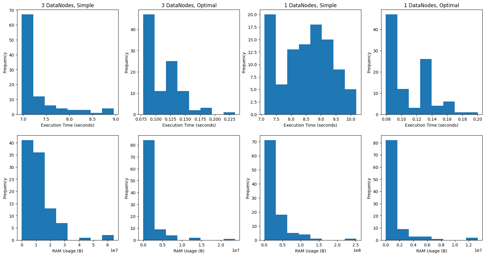

# Spark-Hadoop Practice
The repository devote to work with `hadoop` store system and `spark` application to work with hdfs. The components are upped as docker containers with [docker-compose.yaml](./docker-compose.yml), [Dockerfile](./Dockerfile) and [hadoop](./hadoop.env) configurations. The aim is to compare result both of `time` and `ram` consuming depends on different `hadoop` configuration and `spark` application: `1 DataNode` and `3 DataNode` with `parallel` and `not parallel` application. 

## Results


The results are obtained on subset of a dataset in order to time economy, because one experiment take around 20 hours.
## Clonning
Clone the repository:
```bash
git clone https://github.com/akl-01/spark-hadoop-practice.git
cd spark-hadoop-practice/
```

## Generate Dataset
We use synthetic dataset generated by repetition of small random shuffle subset. The details you could see in [script](./src/dataset_creation.py).
To running the script:
```bash
python3 src/dataset_creation.py
```

## Run
> Python3.10.12 is used

### Up docker-compose
1. Create file for metric output
```bash
bash src/mertic.sh
```

2. Run docker-compose as demon:
```bash
docker-compose up --build -d
```

Useful commands for docker containers manipulation:
- To see all docker containers:
```bash
docker ps
```

- To stop all docker containers:
```bash
docker stop $(docker ps -a -q)
```

- To delete all docker containers:
```bash
docker rm $(docker ps -a -q)
```

- To down docker containers via docker-compose:
```bash
docker-compose down
``` 

### Put the dataset into HDFS
1. Put the dataset into namenode:
```bash
docker cp data/earthquake.csv namenode:/
```

3. Go to namenode command line:
```bash
docker exec -it namenode /bin/bash
```

4. Put the dataset to root of HDFS
```bash
hdfs dfs -put earthquake.csv /
```

### Run
1. Run the application:
```bash
bash ./run.sh <type>
```

Argument:
- `type`: possible values *simple* (without optimization) and *optimal* (with optimization).